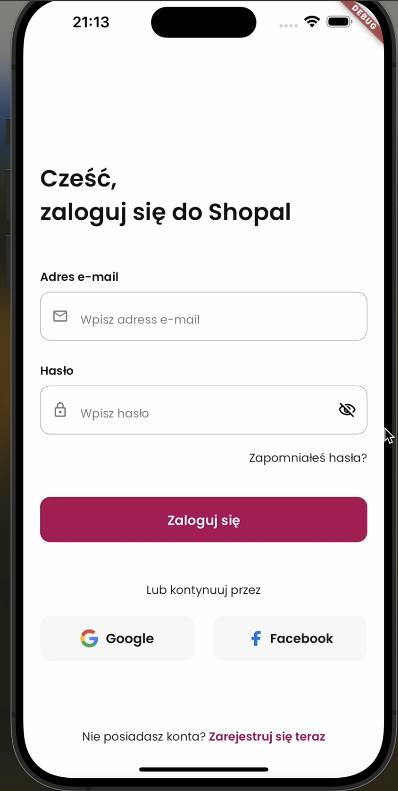
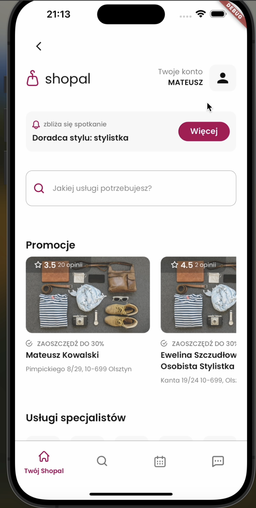
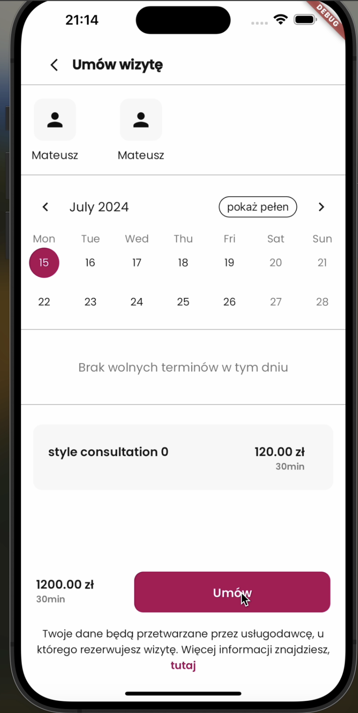
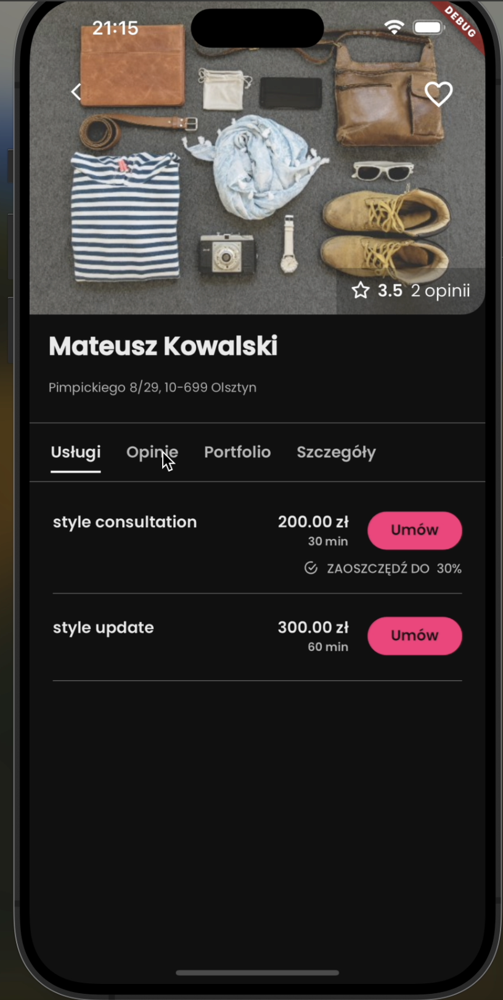

# Shopal

A Flutter application with advanced features and modern architecture for connecting users with stylists.

## Overview

Shopal is a mobile application built with Flutter that helps users find and book appointments with stylists. The app features a clean UI, state management with BLoC pattern, and integration with Supabase backend for a seamless user experience.

## Features

- **User Authentication**: Secure login and registration system with social media integration
- **Stylist Discovery**: Search and browse through stylist profiles with detailed information
- **Appointment Booking**: Schedule appointments with your favorite stylists through an intuitive interface
- **Calendar Integration**: Manage your appointments with an integrated calendar system
- **Chat System**: Direct messaging with stylists for consultation and inquiries
- **Portfolio Viewing**: Browse stylist portfolios and work examples to make informed decisions
- **Reviews & Ratings**: Read and leave reviews for stylists to help the community
- **Dark/Light Theme**: Customizable app appearance for comfortable usage in any environment

## Screenshots

<p align="left">
  
  
  
  
</p>

## Technology Stack

- **Flutter**: UI framework (SDK >=3.2.0)
- **BLoC Pattern**: State management with flutter_bloc for predictable state changes
- **Supabase**: Backend as a Service for authentication and data storage
- **Hive**: Local data persistence for offline capabilities
- **Auto Route**: Navigation management for type-safe routing
- **Rive**: Advanced animations for enhanced user experience
- **Internationalization**: Multi-language support for global users
- **Freezed**: Code generation for immutable models and simplified state management

## Getting Started

### Prerequisites

- Flutter SDK (>=3.2.0)
- Dart SDK (>=3.2.0)
- An IDE (VS Code, Android Studio, etc.)
- Supabase account for backend services

### Installation

1. Clone the repository:
   ```
   git clone <repository-url>
   cd Shopal
   ```

2. Install dependencies:
   ```
   flutter pub get
   ```

3. Set up environment variables:
   Create a file at `lib/src/environment/variables.dart` with your Supabase credentials:
   ```dart
   class EnvironmentVariables {
     static const String supabaseUrl = 'YOUR_SUPABASE_URL';
     static const String supabaseAnnonKey = 'YOUR_SUPABASE_ANON_KEY';
   }
   ```

4. Run code generation:
   ```
   flutter pub run build_runner build --delete-conflicting-outputs
   ```

5. Run the app:
   ```
   flutter run
   ```

## Project Structure

- `assets/`: Contains images, animations, and fonts
- `lib/`: Main source code directory
  - `src/`: Application source code
    - `config/`: App configuration (routes, themes, constants)
    - `modules/`: Feature modules (login, main, specialist, book screens)
    - `repositories/`: Data repositories for handling data operations
    - `services/`: Backend services and authentication
    - `widgets/`: Reusable UI components
    - `utils/`: Utility functions and helpers

## Development

### Code Generation

This project uses several code generation tools for models, routes, and more:

```
flutter pub run build_runner build --delete-conflicting-outputs
```

### Internationalization

The app supports multiple languages through Flutter's built-in localization system. Localized strings are stored in ARB files.

### State Management

The application uses the BLoC pattern for state management, providing a clean separation between UI and business logic.